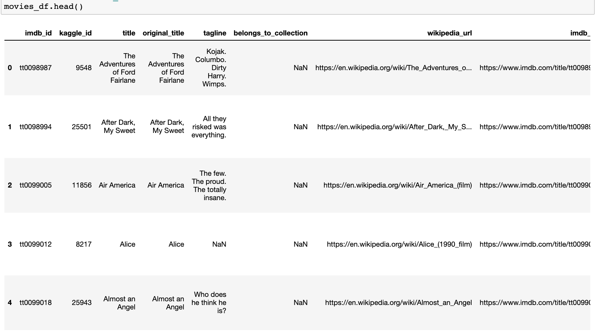
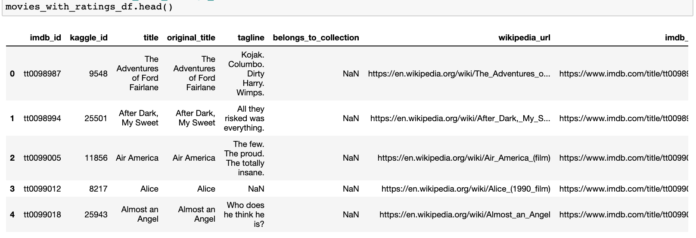
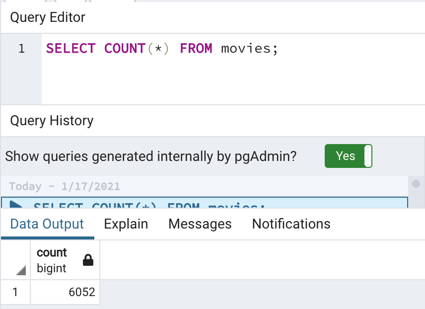
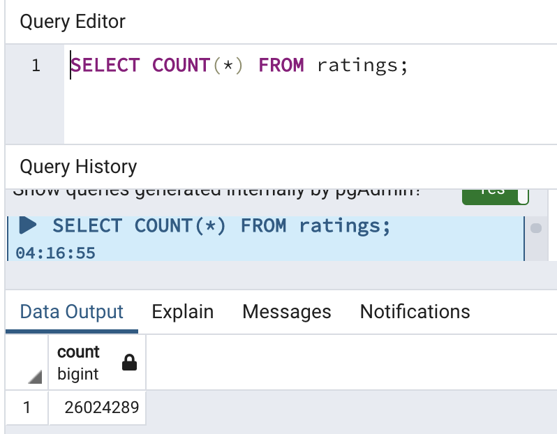

# Movies-ETL
Extracting, transforming and loading movie data from Wikipedia and Kaggle

## Overview
Amazing Prime Video is a video streaming platform that offers a wide variety of movies on demand. To keep their movies up to date, they purchase the streaming rights for movies after leaving theaters. 

Amazing Prime Video would like to develop an algorithm to determine which low budget movies being released will become popular so that they can buy the streaming rights. To do so, they are sponsoring a hackathon asking participants to predict which pictures will become popular. 

The goal of this project is to create a comprehensive dataset with movie information and ratings for the hackathon. We will extract movie data from publicly available sources, transform it into a concise and readable dataset, and load the data into a SQL database.

## Results
The movie data extracted for our dataset includes the following:

### Movie Data Sources:**
- Wikipedia (1990 onward)
- Kaggle
- Movielens ratings

### Final Movie Dataset

### Final Ratings Dataset

### Total Movies and Ratings Counts

## Summary
The final dataset contains 6,052 movies with 26,024,289 ratings. The results of the hackathon will allow Amazing Prime Video to make deciscions about upcoming movie rights to purchase for their streaming platform. 